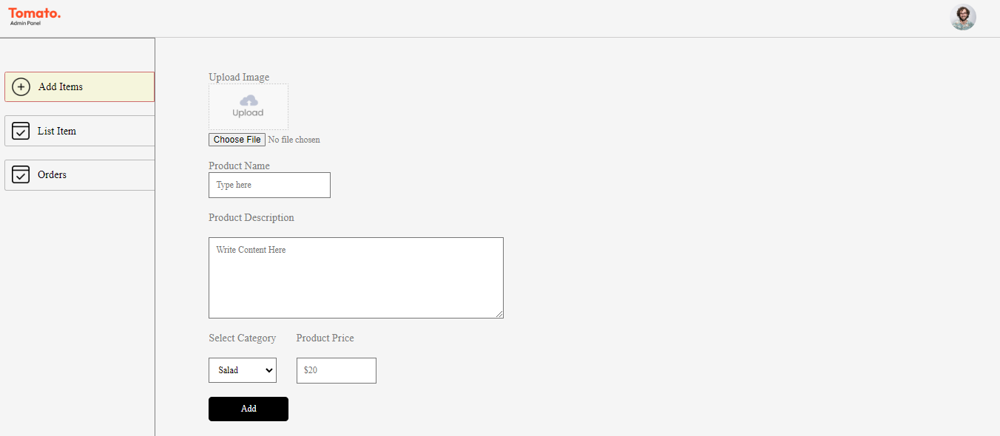

# Food Delivery App Admin Dashboard and Controller

## Overview

This is a ReactJS project that provides an admin dashboard and controller for a food delivery app. The dashboard allows administrators to manage orders, restaurant's Menu.

## Getting Started

### Prerequisites

- Node.js (version 14 or later)
- npm (version 6 or later)
- ReactJS (version 17 or later)

### Installation

1. Clone the repository: `https://github.com/iftekharalammithu/admin-fooddelivery-app.git`
2. Install dependencies: `npm install`
3. Start the development server: `npm start`

## Features

### Dashboard

- Order management: view, edit, and cancel orders
- Restaurant management: view, add, edit, and delete restaurants menu

### Controller

- API integrations: handles API requests and responses
- Business logic: implements rules and validation for orders, restaurants, riders, and customers

## Components

- `App.js`: the main application component
- `Add.js`: the menu CEUD component
- `OrderList.js`: the order list component
- `List.js`: the restaurant list component

## API Endpoints

- `GET /orders`: retrieves a list of orders
- `GET /orders/:id`: retrieves a single order by ID
- `POST /orders`: creates a new order
- `PUT /orders/:id`: updates an existing order
- `DELETE /orders/:id`: deletes an order
- `GET /restaurants`: retrieves a list of restaurants
- `GET /restaurants/:id`: retrieves a single restaurant by ID
- `POST /restaurants`: creates a new restaurant
- `PUT /restaurants/:id`: updates an existing restaurant
- `DELETE /restaurants/:id`: deletes a restaurant
- `GET /riders`: retrieves a list of riders
- `GET /riders/:id`: retrieves a single rider by ID
- `POST /riders`: creates a new rider
- `PUT /riders/:id`: updates an existing rider
- `DELETE /riders/:id`: deletes a rider
- `GET /customers`: retrieves a list of customers
- `GET /customers/:id`: retrieves a single customer by ID
- `POST /customers`: creates a new customer
- `PUT /customers/:id`: updates an existing customer
- `DELETE /customers/:id`: deletes a customer

## Contributing

Contributions are welcome! Please fork the repository, make your changes, and submit a pull request.

## License

This project is licensed under the MIT License.

## Acknowledgments

- Iftekhar Alam Mithu: developer and maintainer
- [Other contributors]: [list of contributors]
